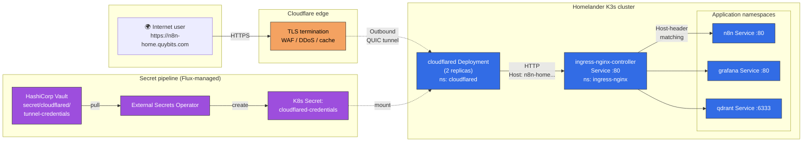

# Publishing Homelab Services Without Port-Forwarding: Cloudflare Tunnel + Flux

I built a homelab to own my own infrastructure. The part I did *not* want to own was: opening ports on my home router, chasing dynamic DNS, managing Let's Encrypt certs, and watching fail2ban logs every week.

Cloudflare Tunnel solves all four in one move, and on the free plan. Here's how I wired it into my Flux-managed K3s cluster to expose n8n, Grafana, Qdrant, and a couple of internal apps on the public internet — and the one domain gotcha I hit halfway through.

---

## 1. Why Cloudflare Tunnel?

I had three requirements:

- **No inbound ports on the home router.** My ISP blocks 80/443 inbound anyway, and I don't want the attack surface. Cloudflare Tunnel uses outbound-only QUIC from inside the cluster.
- **TLS I don't have to think about.** Cloudflare's Universal SSL covers my domain's first-level wildcard for free. No cert-manager DNS-01 dance, no 90-day renewal worry for public hosts.
- **DDoS / WAF / rate-limiting included.** Cloudflare's edge absorbs the garbage before it reaches my Minisforum.

The tradeoff: every request transits Cloudflare. If Cloudflare goes down, so do my public URLs. For homelab-grade services that's a fair deal.

---

## 2. The architecture

One picture beats a thousand configuration files:



Three things to notice:

1. **The arrow from Cloudflare to cloudflared is dashed** — that connection is initiated *outbound* from the cluster. No inbound port, no NAT hole-punching, no router config.
2. **cloudflared → ingress-nginx is HTTP, not HTTPS.** TLS already terminated at Cloudflare's edge. Doubling it up inside the cluster would cost CPU and add cert plumbing for zero security gain.
3. **Credentials flow is one-directional.** The tunnel credentials JSON lives in Vault; External Secrets Operator syncs it into a Kubernetes Secret; cloudflared mounts it. No secrets in Git.

---

## 3. The cluster side

My GitOps repo already had:

- `ingress-nginx` installed as the cluster's Ingress controller
- cert-manager with a self-signed CA issuing certs for `*.homelander.local` (LAN access)
- External Secrets Operator + Vault (`vault-backend` ClusterSecretStore)
- Per-app Kustomize overlays: `apps/<name>/base/` + `apps/<name>/overlays/homelander/`

What I added for Cloudflare Tunnel was four files in a new `infrastructure/cloudflared/` directory:

```
infrastructure/cloudflared/
├── kustomization.yaml     # lists the resources below
├── configmap.yaml         # tunnel routing config
├── externalsecret.yaml    # pulls credentials from Vault
└── deployment.yaml        # cloudflared Deployment, 2 replicas
```

And one Flux Kustomization at `clusters/homelander/cloudflared.yaml` pointing Flux at that directory with `dependsOn: [eso-store, ingress-nginx]`.

The core of the routing config is disarmingly small — one explicit rule per host, all pointing at the in-cluster ingress-nginx Service:

```yaml
# infrastructure/cloudflared/configmap.yaml (excerpt)
ingress:
  - hostname: "n8n-home.quybits.com"
    service: http://ingress-nginx-controller.ingress-nginx.svc.cluster.local:80
    originRequest:
      httpHostHeader: ""      # pass through the original Host header
      connectTimeout: 30s
      noHappyEyeballs: true
  # ... grafana-home, qdrant-home, royal-dispatch-home, royal-dispatch-admin-home
  - service: http_status:404   # catch-all
```

Why `httpHostHeader: ""`? Without it, cloudflared would set `Host:` to the internal cluster DNS (`ingress-nginx-controller.ingress-nginx.svc.cluster.local`), which matches no Ingress rule. The empty string tells cloudflared to pass the client's original Host header through untouched, which is what ingress-nginx needs to do its job.

Then in each app's homelander overlay, I added a **second** host rule to the existing Ingress — keeping the LAN host intact:

```yaml
# apps/n8n/overlays/homelander/ingress-patch.yaml (excerpt)
spec:
  tls:
    - hosts: [n8n.homelander.local]   # LAN cert unchanged
      secretName: n8n-tls
  rules:
    - host: n8n.homelander.local       # LAN path
      http: { paths: [ ... ] }
    - host: n8n-home.quybits.com       # NEW public path (no TLS entry — Cloudflare terminates)
      http: { paths: [ ... ] }
```

Both paths now work: LAN users browse `https://n8n.homelander.local` (self-signed cert via cert-manager); internet users browse `https://n8n-home.quybits.com` (real Cloudflare cert).

---

## 4. The one-time bootstrap

The tunnel itself can't be defined in Git — it's a resource inside Cloudflare that needs to be created with a signed cert. I wrote an idempotent bash script that handles all the non-Git parts:

```bash
./scripts/cloudflared-bootstrap.sh
```

What it does, guarded by a mandatory `kubectl config current-context == "homelander"` check so it can never touch the wrong cluster:

1. `cloudflared tunnel login` (only if `~/.cloudflared/cert.pem` doesn't already exist)
2. `cloudflared tunnel create homelander` (only if the tunnel doesn't already exist)
3. For each of my 5 public hostnames, create or update a Cloudflare DNS CNAME pointing at `<TUNNEL_UUID>.cfargotunnel.com` (proxied). Uses the Cloudflare API if `CF_API_TOKEN` is set; prints manual dashboard instructions otherwise.
4. Copies the per-tunnel credentials JSON into the Vault pod via `kubectl cp`, runs `vault kv put` from inside the pod, then removes the temp file — all wrapped in a `trap EXIT` so the temp file is cleaned up even if the write fails.
5. Prints the `TUNNEL_UUID` for me to paste into `infrastructure/cloudflared/configmap.yaml` (one-time — after that, Flux + ESO handle everything).

Total operator steps, every time I re-run it: one command, one copy-paste. Re-running it is safe because every step checks state first.

---

## 5. The domain gotcha: SSL coverage depth

Here's the thing I wish someone had told me *before* I deployed.

Cloudflare's free-plan **Universal SSL** covers:

- The apex: `quybits.com` ✅
- First-level wildcard: `*.quybits.com` ✅ — so `n8n.quybits.com`, `grafana.quybits.com`, anything one label deep

It does **not** cover:

- Second-level subdomains: `n8n.lab.quybits.com` ❌
- Second-level wildcards: `*.lab.quybits.com` ❌

My first design used `*.lab.quybits.com` — intending to keep homelab services visually separated from my cloud ones on `quybits.com`. The cluster deployed fine. DNS resolved fine. But every browser request to `https://n8n.lab.quybits.com` failed with:

```
curl: (35) OpenSSL/3.0.16: error:0A000410:SSL routines::sslv3 alert handshake failure
```

That's Cloudflare's edge refusing the TLS handshake because its Universal SSL cert doesn't cover two-label subdomains. Terminating TLS somewhere else doesn't help — the browser talks to Cloudflare first, and Cloudflare is the party that has to present a valid cert.

### Three ways out

1. **Pay for Cloudflare Advanced Certificate Manager** (~$10/month per zone). Supports arbitrary hostnames including deeper wildcards. Zero code changes. Cleanest if you're OK paying.
2. **Rename to first-level subdomains.** Since I already used `n8n.quybits.com`, `grafana.quybits.com` etc. for my cloud cluster, I couldn't just drop the prefix. I suffixed the homelab hosts instead: `n8n-home.quybits.com`, `grafana-home.quybits.com`. Free, but you touch every hostname reference in your repo.
3. **Buy a separate domain for the homelab.** ~$10/year one-time. Clean mental separation from your cloud services. Same free SSL as option 2.

I went with option 2 — free, no new moving parts, and the rename is mostly mechanical (sed-style changes in Ingress patches, the cloudflared ConfigMap, a couple of app env vars, and the README). The `-home` suffix reads clearly enough once you're used to it.

### The bits that needed updating

Four kinds of change, plus the DNS:

- **Ingress patches** (n8n, grafana, qdrant, royal-dispatch's four) — just the hostname strings
- **Cloudflared ConfigMap** — wildcard `*.lab.quybits.com` rule replaced with five explicit `<app>-home.quybits.com` rules
- **App config where URLs are baked in** — n8n's `WEBHOOK_URL` / `N8N_EDITOR_BASE_URL` (external webhooks call this back), royal-dispatch's `NEXT_PUBLIC_FRONTEND_URL` and `BACKEND_PUBLIC_URL`
- **Bootstrap script** — the DNS step now loops over a `DNS_HOSTNAMES` array creating each record individually (Cloudflare's API is idempotent for upserts, so re-running is safe)

Grafana's `root_url` was the pleasant surprise: I'd set it to `%(protocol)s://%(domain)s:%(http_port)s/` — Grafana's built-in dynamic template that reflects whatever hostname the request arrived on. That works automatically for both `grafana.homelander.local` (LAN) and `grafana-home.quybits.com` (public) with zero changes. It only works cleanly *because* I also enabled `use-forwarded-headers: "true"` on ingress-nginx — but that's a story for another redirect-loop I had to debug.

---

## 6. The redirect-loop story, abridged

Cloudflare Tunnel talks **HTTP** to ingress-nginx (as designed — TLS terminates at the edge). But every one of my Ingresses had `nginx.ingress.kubernetes.io/ssl-redirect: "true"`, so ingress-nginx returned a 301 to `https://<host>` on every HTTP request. Browser followed the redirect, got back to Cloudflare over HTTPS, Cloudflare sent HTTP to cloudflared again, and… infinite loop.

The fix was one line in the ingress-nginx HelmRelease:

```yaml
# infrastructure/ingress-nginx/helmrelease.yaml
spec:
  values:
    controller:
      config:
        use-forwarded-headers: "true"   # <-- this
```

With that, ingress-nginx honors the `X-Forwarded-Proto: https` header cloudflared sends. If the upstream request was HTTPS, no redirect. LAN HTTP → HTTPS auto-redirect still works (LAN traffic has no forwarded headers, falls through to default behavior). One line, two UX paths preserved.

---

## 7. What the finished state looks like

```
$ dig +short n8n-home.quybits.com
104.21.11.139
172.67.166.37

$ curl -sSI https://n8n-home.quybits.com | head -3
HTTP/2 200
server: cloudflare
cf-ray: ...
```

Valid Cloudflare cert, real response from n8n, zero ports open on my router. Five services (`n8n-home`, `grafana-home`, `qdrant-home`, `royal-dispatch-home`, `royal-dispatch-admin-home`) all reachable from anywhere. LAN-only access (`*.homelander.local`) still works for when I'm at home and don't want to route through Cloudflare.

Everything after the one-time bootstrap lives in Git. Rotating the tunnel credentials means re-running the script and pushing one commit with the new UUID. Adding a new public service means one Ingress patch and one line in the cloudflared ConfigMap. That's the GitOps property I wanted.

---

## 8. What I'd do differently next time

- **Pick the domain depth before writing a single line of YAML.** The rename wasn't hard, but it touched nine files across four commits. Ten minutes of reading Cloudflare's SSL docs would have saved an hour.
- **Consider a separate domain for the homelab.** `$10/year` is nothing; visually `n8n.mylab.dev` is cleaner than `n8n-home.my-other-domain.com`; and you get a free psychological firewall between "this is production" and "this is the thing I break at 11pm on a Thursday."
- **Set `use-forwarded-headers` on ingress-nginx the same day you turn on the tunnel.** Don't learn that one from the browser console.

---

**Repo:** the full setup lives in my GitOps repo under `infrastructure/cloudflared/`, with per-app patches in `apps/*/overlays/homelander/` and the bootstrap script at `scripts/cloudflared-bootstrap.sh`.

If you're running a Flux-managed K3s homelab and you want public access without port-forwarding, this is about as close to "one afternoon, one free account" as it gets — as long as you don't try to go two subdomains deep.
