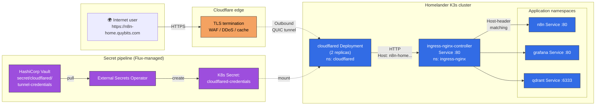
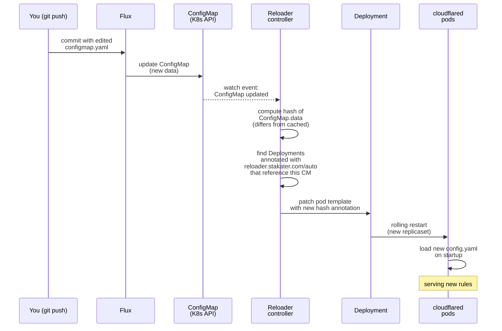

# Publishing Homelab Services Without Port-Forwarding: Cloudflare Tunnel + Flux

I built a homelab to own my own infrastructure. The part I did *not* want to own was: opening ports on my home router, chasing dynamic DNS, managing Let's Encrypt certs, and watching fail2ban logs every week.

Cloudflare Tunnel solves all four in one move, and on the free plan. Here's how I wired it into my Flux-managed K3s cluster to expose n8n, Grafana, Qdrant, and a couple of internal apps on the public internet — and the one domain gotcha I hit halfway through.

---

## 1. Why Cloudflare Tunnel?

I had three requirements:

- **No inbound ports on the home router.** My ISP blocks 80/443 inbound anyway, and I don't want the attack surface. Cloudflare Tunnel uses outbound-only QUIC from inside the cluster.
- **TLS I don't have to think about.** Cloudflare's Universal SSL covers my domain's first-level wildcard for free. No cert-manager DNS-01 dance, no 90-day renewal worry for public hosts.
- **DDoS / WAF / rate-limiting included.** Cloudflare's edge absorbs the garbage before it reaches my Minisforum.

The tradeoff: every request transits Cloudflare. If Cloudflare goes down, so do my public URLs. For homelab-grade services that's a fair deal.

---

## 2. The architecture

One picture beats a thousand configuration files:



Three things to notice:

1. **The arrow from Cloudflare to cloudflared is dashed** — that connection is initiated *outbound* from the cluster. No inbound port, no NAT hole-punching, no router config.
2. **cloudflared → ingress-nginx is HTTP, not HTTPS.** TLS already terminated at Cloudflare's edge. Doubling it up inside the cluster would cost CPU and add cert plumbing for zero security gain.
3. **Credentials flow is one-directional.** The tunnel credentials JSON lives in Vault; External Secrets Operator syncs it into a Kubernetes Secret; cloudflared mounts it. No secrets in Git.

---

## 3. The cluster side

My GitOps repo already had:

- `ingress-nginx` installed as the cluster's Ingress controller
- cert-manager with a self-signed CA issuing certs for `*.homelander.local` (LAN access)
- External Secrets Operator + Vault (`vault-backend` ClusterSecretStore)
- Per-app Kustomize overlays: `apps/<name>/base/` + `apps/<name>/overlays/homelander/`

What I added for Cloudflare Tunnel was four files in a new `infrastructure/cloudflared/` directory:

```
infrastructure/cloudflared/
├── kustomization.yaml     # lists the resources below
├── configmap.yaml         # tunnel routing config
├── externalsecret.yaml    # pulls credentials from Vault
└── deployment.yaml        # cloudflared Deployment, 2 replicas
```

And one Flux Kustomization at `clusters/homelander/cloudflared.yaml` pointing Flux at that directory with `dependsOn: [eso-store, ingress-nginx]`.

The core of the routing config is disarmingly small — one explicit rule per host, all pointing at the in-cluster ingress-nginx Service:

```yaml
# infrastructure/cloudflared/configmap.yaml (excerpt)
ingress:
  - hostname: "n8n-home.quybits.com"
    service: http://ingress-nginx-controller.ingress-nginx.svc.cluster.local:80
    originRequest:
      httpHostHeader: ""      # pass through the original Host header
      connectTimeout: 30s
      noHappyEyeballs: true
  # ... grafana-home, qdrant-home, royal-dispatch-home, royal-dispatch-admin-home
  - service: http_status:404   # catch-all
```

Why `httpHostHeader: ""`? Without it, cloudflared would set `Host:` to the internal cluster DNS (`ingress-nginx-controller.ingress-nginx.svc.cluster.local`), which matches no Ingress rule. The empty string tells cloudflared to pass the client's original Host header through untouched, which is what ingress-nginx needs to do its job.

Then in each app's homelander overlay, I added a **second** host rule to the existing Ingress — keeping the LAN host intact:

```yaml
# apps/n8n/overlays/homelander/ingress-patch.yaml (excerpt)
spec:
  tls:
    - hosts: [n8n.homelander.local]   # LAN cert unchanged
      secretName: n8n-tls
  rules:
    - host: n8n.homelander.local       # LAN path
      http: { paths: [ ... ] }
    - host: n8n-home.quybits.com       # NEW public path (no TLS entry — Cloudflare terminates)
      http: { paths: [ ... ] }
```

Both paths now work: LAN users browse `https://n8n.homelander.local` (self-signed cert via cert-manager); internet users browse `https://n8n-home.quybits.com` (real Cloudflare cert).

---

## 4. The one-time bootstrap

The tunnel itself can't be defined in Git — it's a resource inside Cloudflare that needs to be created with a signed cert. I wrote an idempotent bash script that handles all the non-Git parts:

```bash
./scripts/cloudflared-bootstrap.sh
```

What it does, guarded by a mandatory `kubectl config current-context == "homelander"` check so it can never touch the wrong cluster:

1. `cloudflared tunnel login` (only if `~/.cloudflared/cert.pem` doesn't already exist)
2. `cloudflared tunnel create homelander` (only if the tunnel doesn't already exist)
3. For each of my 5 public hostnames, create or update a Cloudflare DNS CNAME pointing at `<TUNNEL_UUID>.cfargotunnel.com` (proxied). Uses the Cloudflare API if `CF_API_TOKEN` is set; prints manual dashboard instructions otherwise.
4. Copies the per-tunnel credentials JSON into the Vault pod via `kubectl cp`, runs `vault kv put` from inside the pod, then removes the temp file — all wrapped in a `trap EXIT` so the temp file is cleaned up even if the write fails.
5. Prints the `TUNNEL_UUID` for me to paste into `infrastructure/cloudflared/configmap.yaml` (one-time — after that, Flux + ESO handle everything).

Total operator steps, every time I re-run it: one command, one copy-paste. Re-running it is safe because every step checks state first.

---

## 5. The domain gotcha: SSL coverage depth

Here's the thing I wish someone had told me *before* I deployed.

Cloudflare's free-plan **Universal SSL** covers:

- The apex: `quybits.com` ✅
- First-level wildcard: `*.quybits.com` ✅ — so `n8n.quybits.com`, `grafana.quybits.com`, anything one label deep

It does **not** cover:

- Second-level subdomains: `n8n.lab.quybits.com` ❌
- Second-level wildcards: `*.lab.quybits.com` ❌

My first design used `*.lab.quybits.com` — intending to keep homelab services visually separated from my cloud ones on `quybits.com`. The cluster deployed fine. DNS resolved fine. But every browser request to `https://n8n.lab.quybits.com` failed with:

```
curl: (35) OpenSSL/3.0.16: error:0A000410:SSL routines::sslv3 alert handshake failure
```

That's Cloudflare's edge refusing the TLS handshake because its Universal SSL cert doesn't cover two-label subdomains. Terminating TLS somewhere else doesn't help — the browser talks to Cloudflare first, and Cloudflare is the party that has to present a valid cert.

### Three ways out

1. **Pay for Cloudflare Advanced Certificate Manager** (~$10/month per zone). Supports arbitrary hostnames including deeper wildcards. Zero code changes. Cleanest if you're OK paying.
2. **Rename to first-level subdomains.** Since I already used `n8n.quybits.com`, `grafana.quybits.com` etc. for my cloud cluster, I couldn't just drop the prefix. I suffixed the homelab hosts instead: `n8n-home.quybits.com`, `grafana-home.quybits.com`. Free, but you touch every hostname reference in your repo.
3. **Buy a separate domain for the homelab.** ~$10/year one-time. Clean mental separation from your cloud services. Same free SSL as option 2.

I went with option 2 — free, no new moving parts, and the rename is mostly mechanical (sed-style changes in Ingress patches, the cloudflared ConfigMap, a couple of app env vars, and the README). The `-home` suffix reads clearly enough once you're used to it.

### The bits that needed updating

Four kinds of change, plus the DNS:

- **Ingress patches** (n8n, grafana, qdrant, royal-dispatch's four) — just the hostname strings
- **Cloudflared ConfigMap** — wildcard `*.lab.quybits.com` rule replaced with five explicit `<app>-home.quybits.com` rules
- **App config where URLs are baked in** — n8n's `WEBHOOK_URL` / `N8N_EDITOR_BASE_URL` (external webhooks call this back), royal-dispatch's `NEXT_PUBLIC_FRONTEND_URL` and `BACKEND_PUBLIC_URL`
- **Bootstrap script** — the DNS step now loops over a `DNS_HOSTNAMES` array creating each record individually (Cloudflare's API is idempotent for upserts, so re-running is safe)

Grafana's `root_url` was the pleasant surprise: I'd set it to `%(protocol)s://%(domain)s:%(http_port)s/` — Grafana's built-in dynamic template that reflects whatever hostname the request arrived on. That works automatically for both `grafana.homelander.local` (LAN) and `grafana-home.quybits.com` (public) with zero changes. It only works cleanly *because* I also enabled `use-forwarded-headers: "true"` on ingress-nginx — but that's a story for another redirect-loop I had to debug.

---

## 6. The redirect-loop story, abridged

Cloudflare Tunnel talks **HTTP** to ingress-nginx (as designed — TLS terminates at the edge). But every one of my Ingresses had `nginx.ingress.kubernetes.io/ssl-redirect: "true"`, so ingress-nginx returned a 301 to `https://<host>` on every HTTP request. Browser followed the redirect, got back to Cloudflare over HTTPS, Cloudflare sent HTTP to cloudflared again, and… infinite loop.

The fix was one line in the ingress-nginx HelmRelease:

```yaml
# infrastructure/ingress-nginx/helmrelease.yaml
spec:
  values:
    controller:
      config:
        use-forwarded-headers: "true"   # <-- this
```

With that, ingress-nginx honors the `X-Forwarded-Proto: https` header cloudflared sends. If the upstream request was HTTPS, no redirect. LAN HTTP → HTTPS auto-redirect still works (LAN traffic has no forwarded headers, falls through to default behavior). One line, two UX paths preserved.

---

## 7. What the finished state looks like

```
$ dig +short n8n-home.quybits.com
104.21.11.139
172.67.166.37

$ curl -sSI https://n8n-home.quybits.com | head -3
HTTP/2 200
server: cloudflare
cf-ray: ...
```

Valid Cloudflare cert, real response from n8n, zero ports open on my router. Five services (`n8n-home`, `grafana-home`, `qdrant-home`, `royal-dispatch-home`, `royal-dispatch-admin-home`) all reachable from anywhere. LAN-only access (`*.homelander.local`) still works for when I'm at home and don't want to route through Cloudflare.

Everything after the one-time bootstrap lives in Git. Rotating the tunnel credentials means re-running the script and pushing one commit with the new UUID. Adding a new public service means one Ingress patch and one line in the cloudflared ConfigMap. That's the GitOps property I wanted.

---

## 8. What I'd do differently next time

- **Pick the domain depth before writing a single line of YAML.** The rename wasn't hard, but it touched nine files across four commits. Ten minutes of reading Cloudflare's SSL docs would have saved an hour.
- **Consider a separate domain for the homelab.** `$10/year` is nothing; visually `n8n.mylab.dev` is cleaner than `n8n-home.my-other-domain.com`; and you get a free psychological firewall between "this is production" and "this is the thing I break at 11pm on a Thursday."
- **Set `use-forwarded-headers` on ingress-nginx the same day you turn on the tunnel.** Don't learn that one from the browser console.

---

**Repo:** the full setup lives in my GitOps repo under `infrastructure/cloudflared/`, with per-app patches in `apps/*/overlays/homelander/` and the bootstrap script at `scripts/cloudflared-bootstrap.sh`.

If you're running a Flux-managed K3s homelab and you want public access without port-forwarding, this is about as close to "one afternoon, one free account" as it gets — as long as you don't try to go two subdomains deep.

---

## 9. Lesson learned — the day after the tunnel "worked"

I wrote everything above feeling pretty good about myself. Then the next morning I opened `https://n8n-home.quybits.com` in a browser and got… nothing. Blank page. Spinner. Eventually a clean error.

Here's what broke, how I found it, and the permanent fix I eventually put in.

### The symptom

- DNS resolved correctly to Cloudflare IPs.
- TLS handshake succeeded (valid Let's Encrypt cert via Cloudflare's edge).
- Browser returned **HTTP 404** with a zero-byte body in ~40 milliseconds.
- The other four `*-home.quybits.com` hosts: same thing.
- LAN access at `*.homelander.local`: perfectly fine.

Four possible suspects, any of which could give a 404:

1. DNS points somewhere wrong
2. Cloudflare's edge doesn't recognize the hostname
3. cloudflared inside my cluster doesn't match the hostname
4. ingress-nginx doesn't have an Ingress rule for the new host

The core iron law of debugging: **never propose a fix before you have evidence for where the flow actually breaks.** I needed to instrument the path.

### The debug walk-through

I ran everything in parallel — one set of commands for each layer — so I'd have the full picture in one pass instead of iterating fix-then-check.

**Step 1: Is DNS actually pointing at Cloudflare?**

```bash
dig +short n8n-home.quybits.com
# → 172.67.166.37
#   104.21.11.139
```

Cloudflare IPs. DNS works. Eliminates suspect #1.

**Step 2: What does the real HTTP response look like?**

My first curl was sloppy — I piped `curl -v` through `head -40` and my output cut off right before the HTTP response line, leaving me with just the TLS handshake. Lesson: when you're debugging, don't truncate the thing you're trying to read.

Second try:

```bash
curl -sS -v --max-time 15 https://n8n-home.quybits.com/ 2>&1 | grep -E "^(< |\*)" | tail -15
```

Output:

```
< HTTP/2 404
< cf-cache-status: DYNAMIC
< server: cloudflare
< cf-ray: 9f04f1b78cf22c3d-YVR
< STATUS: 404 (0 bytes in 0.038s)
```

A **zero-byte 404 in 38 milliseconds** was the first real clue. nginx's default 404 has a multi-line HTML body. A Cloudflare error page is branded and several KB. **A zero-byte 404 is exactly what `cloudflared` returns when nothing matches — it hits the catch-all `http_status:404` rule in its ingress config.**

So traffic reaches cloudflared. cloudflared just isn't matching the hostname. That narrows it to suspect #3.

**Step 3: Is it my Ingress? Test ingress-nginx directly, bypass cloudflared.**

```bash
kubectl -n ingress-nginx run --rm -it --restart=Never curl-test \
  --image=curlimages/curl:latest -- \
  curl -sI -H "Host: n8n-home.quybits.com" http://ingress-nginx-controller:80/
# → HTTP/1.1 308 Permanent Redirect
#   Location: https://n8n-home.quybits.com
```

ingress-nginx correctly matches the new host and tries to redirect HTTP→HTTPS. The 308 is expected (I didn't send `X-Forwarded-Proto: https` from inside the test pod — ingress-nginx did its job and redirected). If my Ingress was broken I'd get a 404 from nginx here, not a redirect. **Ingress-nginx is fine — suspect #4 eliminated.**

Bonus evidence from ingress-nginx's access logs: I could see the test request (`10.42.1.98 - - "HEAD / HTTP/1.1" 308 ... [n8n-n8n-80]`) but **zero requests for `n8n-home.quybits.com` from cloudflared**. So cloudflared wasn't even sending traffic toward ingress-nginx for that hostname — it was returning 404 before it got there.

**Step 4: Check the cloudflared ConfigMap in the cluster.**

```bash
kubectl -n cloudflared get cm cloudflared-config -o yaml | grep -A2 "hostname:"
# → hostname: "n8n-home.quybits.com"
#   service: http://ingress-nginx-controller...
#   ... (all 5 hostnames present)
```

The cluster's ConfigMap has every expected rule. So Flux applied the rename correctly.

At this point I had a contradiction: **the ConfigMap has the right rules, but cloudflared is behaving as if it doesn't.** That can only be true if the pod is running a different version of the config than what's on disk.

### The "a-ha" moment — a timeline analysis

I pulled the timestamps for every relevant event:

| Event | Time (UTC) |
|---|---|
| cloudflared pods started | 05:32:20 |
| ConfigMap first created | 05:32:19 |
| Rework commit authored (5-hostname rules) | 05:42:30 (on branch) |
| **PR merged to main** | **12:40:24** |
| Current time when debugging | ~13:25 |

The pods had been running for **7 hours and 53 minutes** — since *before* the merge. Flux had updated the ConfigMap on the API server when the merge landed (I verified the current content), but the pods were still running with the *original* rules (`*.lab.quybits.com` wildcard) loaded into their process memory from when they started.

Why? **cloudflared reads its config file once, at startup, and never again.** A ConfigMap update changes the file that kubelet projects into the pod's volume mount, but cloudflared has no filesystem watcher and doesn't react. Neither does Kubernetes — a ConfigMap update is not a Deployment update, so there's no rolling restart.

### The immediate fix

One command:

```bash
kubectl -n cloudflared rollout restart deployment/cloudflared
```

Thirty seconds later:

```bash
curl -sS https://n8n-home.quybits.com/ | head -c 100
# → <!DOCTYPE html>
#   <html lang="en">
#   <head>
#     <meta charset="utf-8" />
#     <meta name="n8n:config:rest-endpoint" ...
```

Real n8n HTML. All five hosts came up.

### The permanent fix — Stakater Reloader

The immediate fix is nice, but a manual `rollout restart` every time I tweak a ConfigMap is exactly the operator toil I was trying to eliminate with GitOps. And the failure mode is silent — the bug doesn't show up in `flux get kustomization` or `kubectl get pods`; everything looks green, the service just serves the wrong thing.

**Stakater Reloader** is a tiny Kubernetes controller that solves this. It watches all ConfigMaps and Secrets cluster-wide, computes a hash of their `data`, and when the hash changes it triggers a rolling restart of any Deployment that has opted in via an annotation.

#### How Reloader works



The key insight: Reloader changes the **pod template**, not the ConfigMap. That's what makes Kubernetes think "this Deployment's spec changed, time to roll." The ConfigMap content itself stays untouched; Reloader just pokes the Deployment so the default rolling-update machinery fires.

#### Installing it (Flux-managed, ~30 lines of YAML)

**`infrastructure/reloader/helmrepository.yaml`:**
```yaml
apiVersion: source.toolkit.fluxcd.io/v1
kind: HelmRepository
metadata:
  name: stakater
  namespace: flux-system
spec:
  interval: 1h
  url: https://stakater.github.io/stakater-charts
```

**`infrastructure/reloader/helmrelease.yaml`:**
```yaml
apiVersion: helm.toolkit.fluxcd.io/v2
kind: HelmRelease
metadata:
  name: reloader
  namespace: reloader
spec:
  interval: 30m
  chart:
    spec:
      chart: reloader
      version: ">=1.0.0 <2.0.0"
      sourceRef:
        kind: HelmRepository
        name: stakater
        namespace: flux-system
  values:
    reloader:
      watchGlobally: true
      reloadStrategy: default
      deployment:
        resources:
          requests: { cpu: 10m, memory: 32Mi }
          limits:   { cpu: 100m, memory: 128Mi }
```

Plus a Flux Kustomization at `clusters/<cluster>/reloader.yaml`, an entry in the central `namespaces/namespaces.yaml`, and the resource listing in the cluster's top-level kustomization. Reloader's footprint is tiny — one pod, ~30MB resident memory, no CRDs.

**The opt-in on the cloudflared side is literally one annotation:**

```yaml
# infrastructure/cloudflared/deployment.yaml
metadata:
  name: cloudflared
  namespace: cloudflared
  annotations:
    reloader.stakater.com/auto: "true"   # <-- this
```

`auto` means "restart this Deployment whenever any ConfigMap or Secret it references changes." That covers both the tunnel config (ConfigMap) and the tunnel credentials (Secret synced from Vault by External Secrets Operator). If I ever rotate the tunnel credentials in Vault, ESO will update the Secret, Reloader will see the new hash, and cloudflared will pick up the rotation automatically.

#### Verifying it end-to-end

The demo I ran to prove it works:

```bash
# 1. Baseline: note the current pod names
kubectl -n cloudflared get pods -l app=cloudflared
# cloudflared-54c6ff65bd-78nhb   1/1 Running
# cloudflared-54c6ff65bd-hddm6   1/1 Running

# 2. Poke the ConfigMap with a harmless extra key
kubectl -n cloudflared patch cm cloudflared-config --type=merge \
  -p "{\"data\":{\"reloader-test\":\"$(date +%s)-changed\"}}"

# 3. Watch Reloader's log
kubectl -n reloader logs -l app=reloader-reloader -f
# level=info msg="Changes detected in 'cloudflared-config' of type
#  'CONFIGMAP' in namespace 'cloudflared'; updated 'cloudflared' of
#  type 'Deployment' in namespace 'cloudflared'"

# 4. Five seconds later — new pods
kubectl -n cloudflared get pods -l app=cloudflared
# cloudflared-5bd9fc76dd-4hq66   1/1 Running   15s
# cloudflared-5bd9fc76dd-zshrj   1/1 Running    8s
```

And because the Deployment has `maxUnavailable: 0`, traffic continuity held — I hit all five public URLs mid-rollout and every one of them responded with the expected status code.

### Take-aways

- **The symptom of a stale-config cache isn't a crash — it's silence.** Your cluster is green. Your Flux is Ready. Your browser gets a 404. If you only look at control-plane health you'll miss it.
- **Timeline analysis is a power tool in debugging.** "Pod age < ConfigMap change time" told me more in one glance than an hour of reading logs would have. Always pull event timestamps when you have a "but that shouldn't be possible" moment.
- **"Read the config once at startup" is common in networking daemons** (HAProxy, NGINX, cloudflared, Traefik in some modes). Whenever you run one on Kubernetes, ask immediately: *what triggers the reload?* The answer is almost never "the ConfigMap changes."
- **Reloader is `$0`, ~30 lines of YAML, and installs in under a minute.** If you're doing GitOps with any config-driven workload, install it on day one. I learned this one the way I learn most things: after I needed it.

The full Reloader install is on the `feat/reloader` branch in my repo, now merged. One annotation, one less class of bug.
