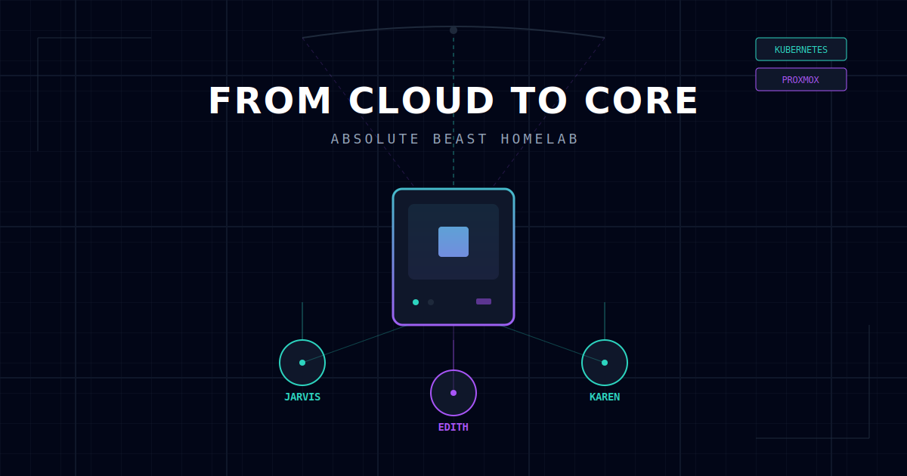
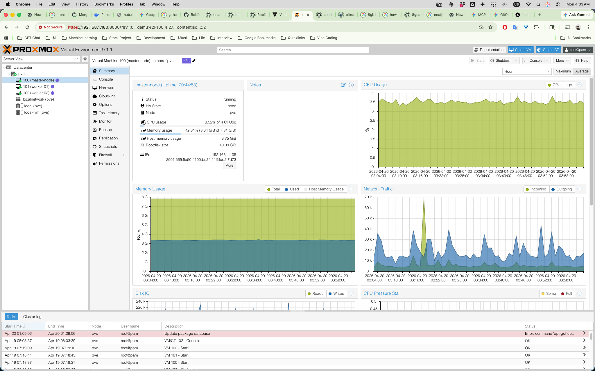
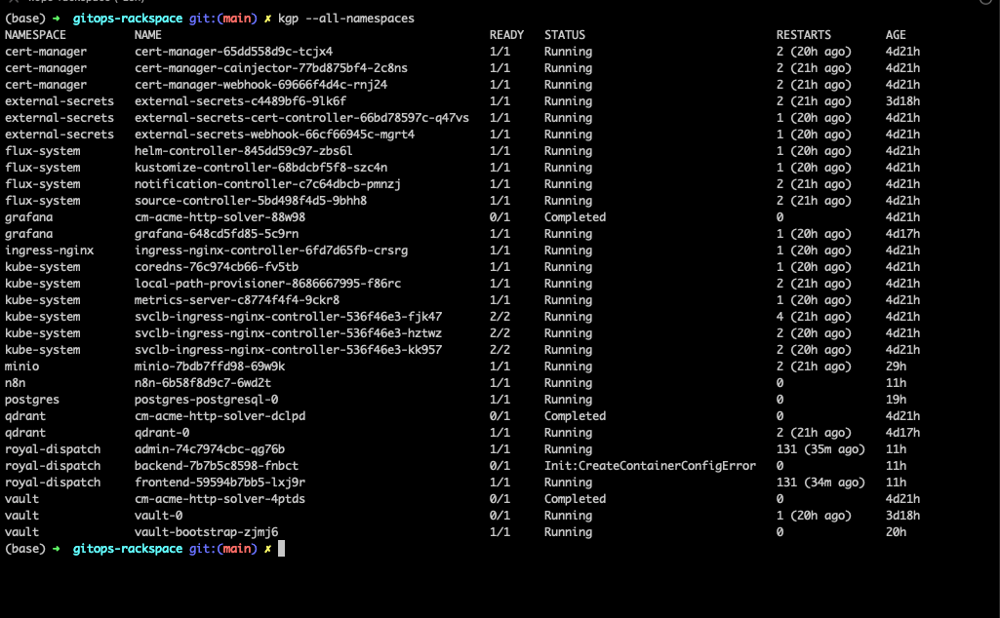

# From Cloud to Core: Building the "Absolute Beast" Homelab



For the past year, my digital life lived on **Rackspace**. It was perfect: for less than $20 a month, I had a reliable 3-node Kubernetes cluster running Grafana, Prometheus, n8n, and Postgres. It was cheap, stable, and it worked.

But as any developer knows, eventually "enough" isn't enough anymore. This weekend, I finally pulled the trigger, wiped a brand-new Minisforum UM890 Pro, and started building my own infrastructure from scratch.

---

## 1. Why build a homelab?
Rackspace served me well, but I wanted more. A few reasons:

Before, picking up anything new meant dedicating serious time digging through docs and forums, or paying good money for someone experienced to teach you. Now, for $25/month, you have a teacher that’s available every day, any hour, and never runs out of patience. With a deal like that, why not just learn it? Do the homework. Break things. Fix them. That’s how you actually understand it, and it’s the only way to know if what AI told you was even right.

On the money side, 32GB of RAM and an 8-core/16-thread CPU in the cloud would cost hundreds of dollars a month. The UM890 Pro was a one-time purchase and I own it forever.

I also just want to understand the underlying systems. Kubernetes is the surface — storage, networking, hardware management are where the real learning happens. I have some infrastructure and DevOps projects coming up, and I want to actually understand this stuff before I build on top of it.

And if the homelab doesn’t work out as a cluster, I can always repurpose it as a dedicated AI node for running local LLMs. The Ryzen 9 is already solid, and the OCuLink port means I can add an eGPU later.

---

## 2. The build

I went with **Proxmox VE** as my base layer. Why? Because I value my weekends. If I break a Kubernetes node while experimenting, I want to restore a snapshot in seconds, not re-image an entire SSD.

### Step 1: Storage

First architectural choice: the storage screen. I went with **LVM-Thin** on my 1TB NVMe. ZFS is great if you have multiple drives and ECC RAM, but for a single NVMe setup, LVM-Thin is simpler and doesn't eat your memory.

### Step 2: Three VMs (Jarvis, Edith, and Karen)
I built a 3-node cluster manually so each node starts clean.

| Node Name | Role | Resources |
| :--- | :--- | :--- |
| **Jarvis** | Master (Control Plane) | 4 vCPU, 8GB RAM |
| **Edith** | Worker 01 | 4 vCPU, 10GB RAM |
| **Karen** | Worker 02 | 4 vCPU, 10GB RAM |

> A quick story about validating AI advice: AI initially suggested 16GB for the master and 6GB per worker. Sounds reasonable, right? In practice, the master sat at 10-20% RAM usage while the workers were hitting 80-90%, and I hadn't even deployed my own apps yet. Just a few open-source tools. I reshuffled to 8GB master / 10GB workers and things calmed down. I'll probably tweak it again, but that's the point. You only figure this out by actually running it.

One gotcha: Proxmox couldn't see the internal IP addresses of my VMs at first. Turns out you need to install `qemu-guest-agent` inside the Ubuntu VM.
```bash
sudo apt update && sudo apt install qemu-guest-agent -y
```

### Step 3: Remote access with Tailscale
I went with **Tailscale** over a Cloudflare Tunnel for remote access. Simpler setup, no port forwarding, no dynamic DNS.

```bash
# On each VM
curl -fsSL https://tailscale.com/install.sh | sh
sudo tailscale up --authkey <YOUR_TAILSCALE_AUTH_KEY>
```

### Step 4: Bootstrapping k3s

On **Jarvis** (the Master), I initialized k3s with a flag to allow remote access via the Tailscale IP:

```bash
curl -sfL https://get.k3s.io | sh -s - server --tls-san <MY_TAILSCALE_IP>
```

Get the token for joining the cluster:

```bash
sudo cat /var/lib/rancher/k3s/server/node-token
```

On **Edith** and **Karen** (the Workers), I joined the cluster using the token from Jarvis:

```bash
curl -sfL https://get.k3s.io | K3S_URL=https://<JARVIS_TAILSCALE_IP>:6443 K3S_TOKEN=<TOKEN_FROM_JARVIS> sh -
```

Go to Jarvis and check the nodes:

```bash
kubectl get nodes
```

### Step 5: Kubeconfig

To manage the cluster from my laptop, I copied the kubeconfig from Jarvis:

**On Jarvis**

```bash
sudo cp /etc/rancher/k3s/k3s.yaml ~/temp.yaml
sudo chown $USER:$USER ~/temp.yaml
```

On my local machine, I copied the file over using `scp`:

```bash
scp user@jarvis:~/temp.yaml ~/.kube/config-homelab
```

Then, I edited the `~/.kube/config-homelab` file to replace `127.0.0.1` with Jarvis's Tailscale IP:

```bash
sed -i 's/127.0.0.1/<JARVIS_TAILSCALE_IP>/g' ~/.kube/config-homelab
```

I didn't want to lose access to my existing Rackspace or Minikube clusters though, so I merged everything into one kubeconfig:

```bash
export KUBECONFIG=~/.kube/config:~/.kube/config-rackspace:~/.kube/config-homelab
kubectl config view --flatten > ~/.kube/config_merged
mv ~/.kube/config_merged ~/.kube/config
```

Now I just use `kubectx` to switch between them:
```bash
kubectx homelander     # Talking to my local homelab
kubectx rackspace     # Now I'm talking to the Cloud
```

---

## 3. The result

Here's the Proxmox dashboard after everything settled in:



And everything running on the cluster:


